# 初次尝试GPU Driver —— 大范围植被渲染

*GPU Driver简单概要，即把整体逻辑放到GPU上运行，解放CPU压榨GPU，初次尝试，记录一下研究过程。*

*渡神纪*
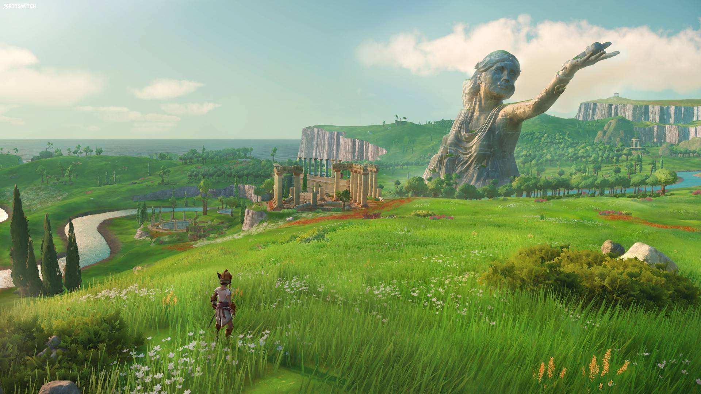

*塞尔达*
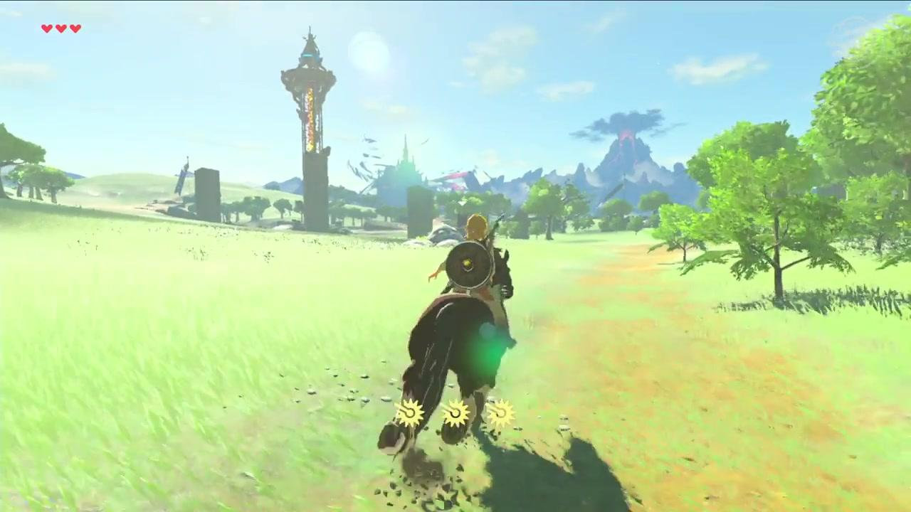

*塞尔达*
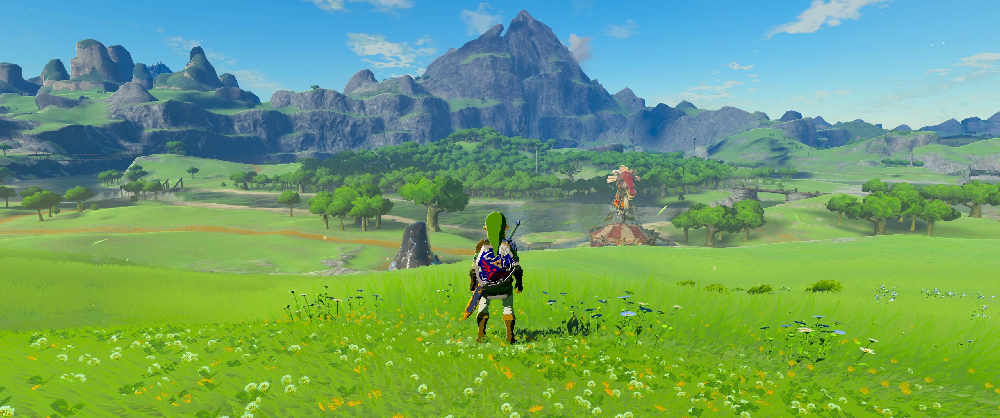

*塞尔达*
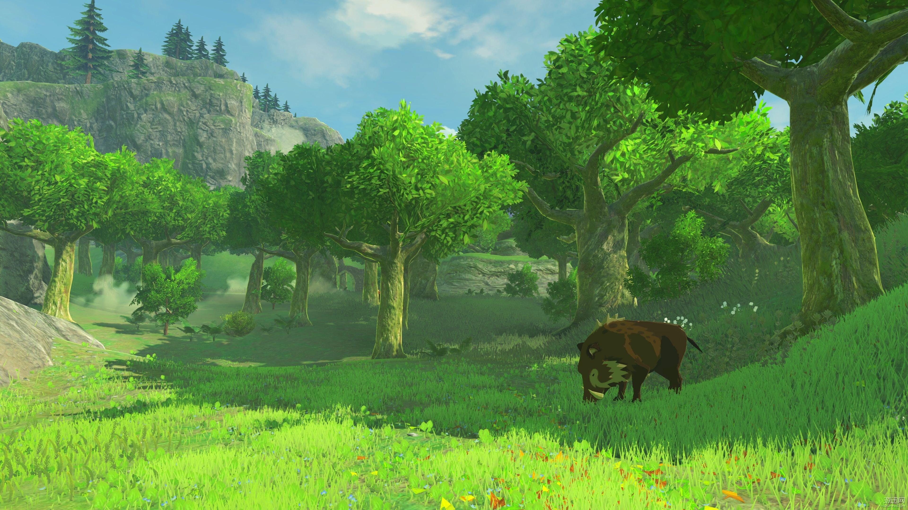

在开放世界游戏里，经常会有大范围植被渲染，这些花花草草数量惊人，动辄数十上百万，光看这数字都能感觉到性能压力扑面而来，那么这些花花草草值得花费如此高昂成本去渲染吗？究竟是人性的扭曲，还是道德的沦丧？

**先写个初版实现效果**

初版实现很简单，通过一张纹理控制草的生长范围，把世界坐标映射到纹理UV，从纹理采样判断该坐标上是否长草，筛选完所有坐标后，GPU Instance就可以了。这个思路简单粗暴，一次渲染了整个场景的草，假设这个场景大小是1024 x 1024平方米，每平方米1颗草，那么一次就要渲染100百万颗草。接下来尝试优化这个过程，在游戏中，每一个瞬间并不能看到全部内容，视野外的看不见，被挡住的看不见，事实上大部分内容都看不见，在那些看不到的地方渲染的草是多余的，剔除掉这些多余的草则是本例的目的。

本例通过以下4个步骤进行剔除：

* 限定渲染范围
* 对渲染范围四叉分割LOD
* 视锥裁剪
* HizMap裁剪

**1. 限定渲染范围**

计算出视锥体的包围盒，用该包围盒覆盖的平面范围去采样，从而限定渲染范围，该步骤目的是为了让渲染范围仅跟视野范围相关而不会随着场景越大渲染范围越大。

部分代码:
```C#
void UpdateFrustumAABB(Vector3 coord)
{
    if      (coord.x < mFrustumAABB.x) { mFrustumAABB.x = coord.x; }
    else if (coord.x > mFrustumAABB.z) { mFrustumAABB.z = coord.x; }
    if      (coord.z < mFrustumAABB.y) { mFrustumAABB.y = coord.z; }
    else if (coord.z > mFrustumAABB.w) { mFrustumAABB.w = coord.z; }
}

...

var halfFovTan = Mathf.Tan(GrabDepthComp.SelfCamera.fieldOfView * Mathf.Deg2Rad * 0.5f);

var nearHalfH = halfFovTan * GrabDepthComp.SelfCamera.nearClipPlane;
var farHalfH  = halfFovTan * GrabDepthComp.SelfCamera.farClipPlane;

var nearToT = nearHalfH                                   * GrabDepthComp.SelfCamera.transform.up;
var nearToR = nearHalfH * GrabDepthComp.SelfCamera.aspect * GrabDepthComp.SelfCamera.transform.right;

var farToT = farHalfH                                   * GrabDepthComp.SelfCamera.transform.up;
var farToR = farHalfH * GrabDepthComp.SelfCamera.aspect * GrabDepthComp.SelfCamera.transform.right;

var nearPosition = GrabDepthComp.SelfCamera.transform.position + GrabDepthComp.SelfCamera.transform.forward * GrabDepthComp.SelfCamera.nearClipPlane;
var farPosition  = GrabDepthComp.SelfCamera.transform.position + GrabDepthComp.SelfCamera.transform.forward * GrabDepthComp.SelfCamera.farClipPlane;

mFrustumNearLB = nearPosition - nearToT - nearToR;
mFrustumNearRB = nearPosition - nearToT + nearToR;
mFrustumNearLT = nearPosition + nearToT - nearToR;
mFrustumNearRT = nearPosition + nearToT + nearToR;

mFrustumFarLB = farPosition - farToT - farToR;
mFrustumFarRB = farPosition - farToT + farToR;
mFrustumFarLT = farPosition + farToT - farToR;
mFrustumFarRT = farPosition + farToT + farToR;

//  计算视锥AABB
mFrustumAABB = new Vector4(GrabDepthComp.SelfCamera.transform.position.x, GrabDepthComp.SelfCamera.transform.position.z,
                           GrabDepthComp.SelfCamera.transform.position.x, GrabDepthComp.SelfCamera.transform.position.z);
UpdateFrustumAABB(mFrustumNearLB);
UpdateFrustumAABB(mFrustumNearRB);
UpdateFrustumAABB(mFrustumNearLT);
UpdateFrustumAABB(mFrustumNearRT);
UpdateFrustumAABB(mFrustumFarLB);
UpdateFrustumAABB(mFrustumFarRB);
UpdateFrustumAABB(mFrustumFarLT);
UpdateFrustumAABB(mFrustumFarRT);
mFrustumAABB.x = Mathf.Clamp(mFrustumAABB.x - FrustumOutDistance, 0, WorldSize);
mFrustumAABB.y = Mathf.Clamp(mFrustumAABB.y - FrustumOutDistance, 0, WorldSize);
mFrustumAABB.z = Mathf.Clamp(mFrustumAABB.z + FrustumOutDistance, 0, WorldSize);
mFrustumAABB.w = Mathf.Clamp(mFrustumAABB.w + FrustumOutDistance, 0, WorldSize);
```

效果：

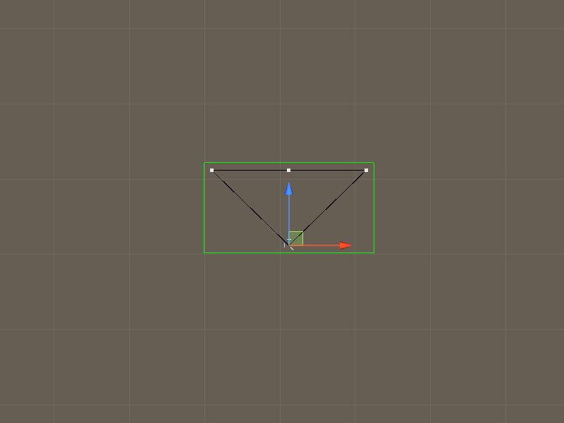

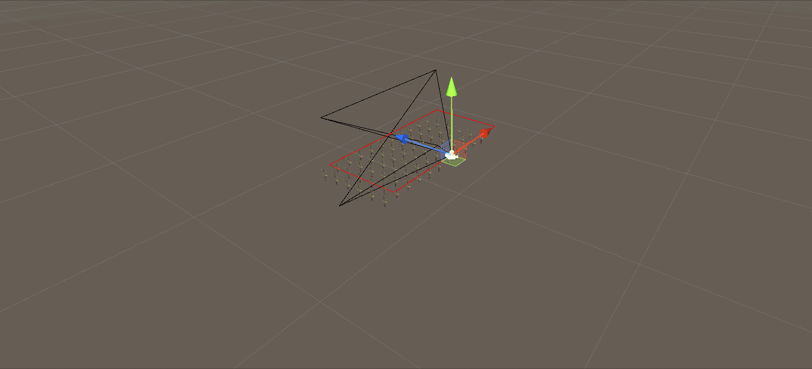

**2. 对渲染范围四叉分割LOD**

虽然上述步骤限定了渲染范围，但范围依旧很大，比如站在高山上看远方，视野开阔，可视距离远，但并非可见之处都需要渲染高密度的草丛，因为远方的草丛看不见细节，只能看到一片绿色，该步骤将渲染范围拆分多个LOD，近处的高密度渲染，远处的低密度渲染。（通常会把长草的地面用绿色，从而达到在远处看，即使没有草丛也会看到一片绿，可见文章开头第三张图片）

四叉树分割算法大致思路是，若区块中心到相机的距离短于区块最长边，则该区块需要四叉分割并且LOD+1。

初始的区块LOD为0，随着多次细分，LOD逐渐变大，LOD越大则渲染越密集。

部分代码：

```C#
class FrustumTreeNode {
    public int LOD;
    public Vector4 AABB;

    public FrustumTreeNode(int lod, Vector4 aabb)
    {
        LOD = lod; AABB = aabb;
    }
}

...

var cameraCoord = new Vector2(GrabDepthComp.transform.position.x,
                              GrabDepthComp.transform.position.z);
mFrustumTreeA.Clear();
mFrustumTreeA.Add(new FrustumTreeNode(0, mFrustumAABB));

for (var lod = 0; lod != LODNumber; ++lod)
{
    mFrustumTreeB.Clear();
    for (var i = 0; i != mFrustumTreeA.Count; ++i)
    {
        var length = Mathf.Max(mFrustumTreeA[i].AABB.z - mFrustumTreeA[i].AABB.x,
                               mFrustumTreeA[i].AABB.w - mFrustumTreeA[i].AABB.y);
        var center = new Vector2((mFrustumTreeA[i].AABB.x + mFrustumTreeA[i].AABB.z) / 2,
                                 (mFrustumTreeA[i].AABB.y + mFrustumTreeA[i].AABB.w) / 2);
        if ((cameraCoord - center).magnitude < length)
        {
            mFrustumTreeB.Add(new FrustumTreeNode(lod + 1, new Vector4(mFrustumTreeA[i].AABB.x, mFrustumTreeA[i].AABB.y, center.x, center.y)));
            mFrustumTreeB.Add(new FrustumTreeNode(lod + 1, new Vector4(center.x, mFrustumTreeA[i].AABB.y, mFrustumTreeA[i].AABB.z, center.y)));
            mFrustumTreeB.Add(new FrustumTreeNode(lod + 1, new Vector4(center.x, center.y, mFrustumTreeA[i].AABB.z, mFrustumTreeA[i].AABB.w)));
            mFrustumTreeB.Add(new FrustumTreeNode(lod + 1, new Vector4(mFrustumTreeA[i].AABB.x, center.y, center.x, mFrustumTreeA[i].AABB.w)));
        }
        else
        {
            mFrustumTreeB.Add(mFrustumTreeA[i]);
        }
    }
    Tools.Swap(ref mFrustumTreeA, ref mFrustumTreeB);
}
```

效果：

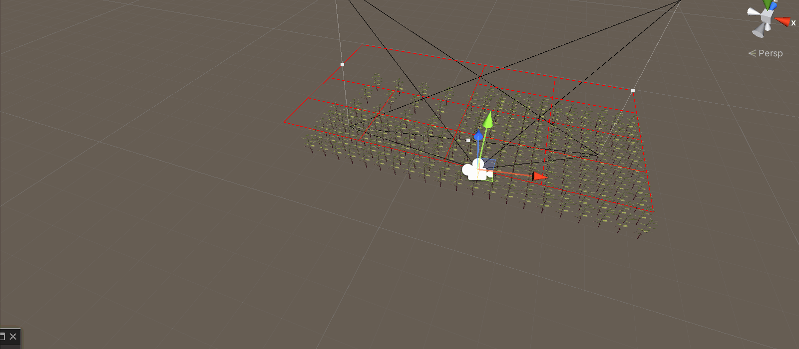

**3. 视锥裁剪**

前面两步剔除掉了大量额外渲染，但渲染范围是通过包围盒求出的，包围盒是一个长方体，它除了覆盖视野范围还覆盖了一些多余的范围，该步骤将剔除这些多余的范围。

思路是先求出视锥的6个面，随后在Compute Shader中，对每个单位求出包围盒，如果这个包围盒不在视锥体的6个面内，则该单位不可见。

首先每个单位的包围盒是很好计算的，只要有坐标就可以算出包围盒，而坐标在第一步中就能拿到。

其次，视锥体的6个面可通过UnityAPI算出，但据说引擎会调用到底层的C++导致一些不必要的开销，并且该接口需要Plane对象，导致后面对Shader传参不方便，所以手动算就好了。
第一步已经计算出了视锥体的8个顶点，所以拿这8个顶点就能计算6个平面了。

部分代码：

*C#*

```C#
//  计算视锥裁剪面
//  左右
var lNormal = Vector3.Cross(mFrustumNearLB - mFrustumFarLB, mFrustumNearLT - mFrustumNearLB).normalized;
var rNormal = Vector3.Cross(mFrustumNearRB - mFrustumNearRT, mFrustumFarRB - mFrustumNearRB).normalized;
//  下上
var dNormal = Vector3.Cross(mFrustumNearLB - mFrustumNearRB, mFrustumFarLB - mFrustumNearLB).normalized;
var uNormal = Vector3.Cross(mFrustumNearRT - mFrustumNearLT, mFrustumFarRT - mFrustumNearRT).normalized;
//  近远
var nNormal = Vector3.Cross(mFrustumNearRB - mFrustumNearLB, mFrustumNearRT - mFrustumNearRB).normalized;
var fNormal = Vector3.Cross(mFrustumFarRB  - mFrustumFarRT,  mFrustumFarLB  - mFrustumFarRB).normalized;

mFrustumPlanes[0] = lNormal; mFrustumPlanes[0].w = Vector3.Dot(lNormal, -mFrustumNearLB);
mFrustumPlanes[1] = rNormal; mFrustumPlanes[1].w = Vector3.Dot(rNormal, -mFrustumNearRB);
mFrustumPlanes[2] = dNormal; mFrustumPlanes[2].w = Vector3.Dot(dNormal, -mFrustumNearLB);
mFrustumPlanes[3] = uNormal; mFrustumPlanes[3].w = Vector3.Dot(uNormal, -mFrustumNearRT);
mFrustumPlanes[4] = nNormal; mFrustumPlanes[4].w = Vector3.Dot(nNormal, -mFrustumNearRB);
mFrustumPlanes[5] = fNormal; mFrustumPlanes[5].w = Vector3.Dot(fNormal, -mFrustumFarRB);
```

*HLSL*

```C++
bool IsCullByPlane(float3 coord, float width, float4 plane)
{
    return dot(coord + float3(-width, -width, -width), plane.xyz) + plane.w <= 0
        && dot(coord + float3( width, -width, -width), plane.xyz) + plane.w <= 0
        && dot(coord + float3( width,  width, -width), plane.xyz) + plane.w <= 0
        && dot(coord + float3(-width,  width, -width), plane.xyz) + plane.w <= 0

        && dot(coord + float3(-width, -width,  width), plane.xyz) + plane.w <= 0
        && dot(coord + float3( width, -width,  width), plane.xyz) + plane.w <= 0
        && dot(coord + float3( width,  width,  width), plane.xyz) + plane.w <= 0
        && dot(coord + float3(-width,  width,  width), plane.xyz) + plane.w <= 0;
}

bool IsCullByFrustum(float3 coord, float width)
{
    return IsCullByPlane(coord, width, _FrustumPlanes[0])
        || IsCullByPlane(coord, width, _FrustumPlanes[1])
        || IsCullByPlane(coord, width, _FrustumPlanes[2])
        || IsCullByPlane(coord, width, _FrustumPlanes[3])
        || IsCullByPlane(coord, width, _FrustumPlanes[4])
        || IsCullByPlane(coord, width, _FrustumPlanes[5]);
}
```

效果：

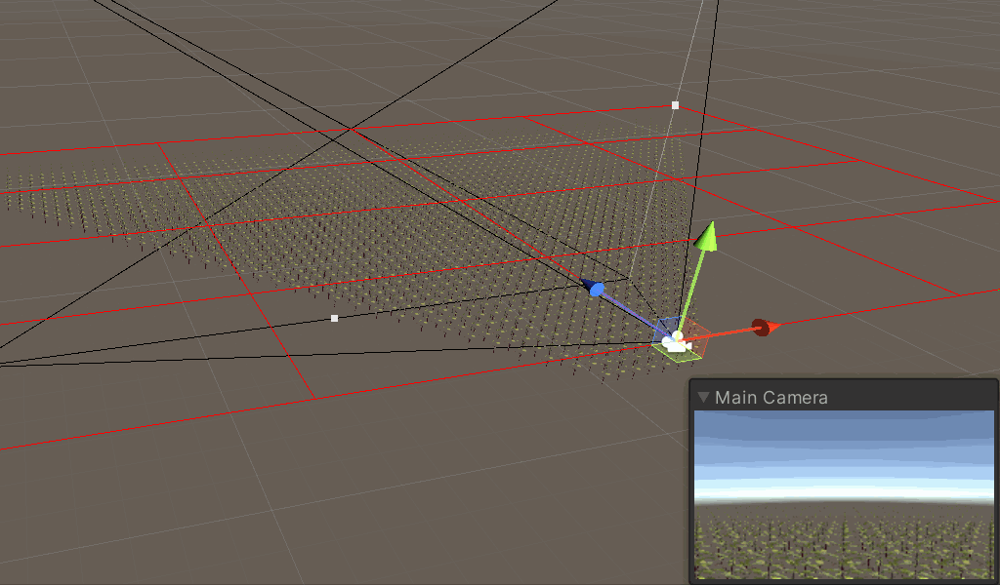

**1.HizMap裁剪**

经过上述三个步骤，几乎剔除掉了所有多余单位，但在有些情况下，仍然有多余的单位被渲染。例如前面有一堵墙，墙后的单位看不见，但它仍然被渲染，只不过最终没有呈现在屏幕上，当前步骤则用于剔除墙后的单位。

HizMap的全名叫Hierarchical Z-buffer Map，它主要有两部分：
* 生成HizMap
* 使用HizMap

**生成HizMap**

把当前帧或上一帧（也可以是任何你想要的深度）的深度图生成Mipmaps，但该Mipmaps跟常规的生成方式不一样，常规Mipmaps是通过插值迭代每一层，而HizMap是通过取最大（或最小）的值迭代每一层，当生成Mipmaps之后，即可在后续的步骤使用它。

**使用HizMap**

当渲染一个单位时，求出该单位的屏幕空间包围盒，然后再查询对应LOD的HizMap，HizMap中记录的是最终深度，如果该单位所查询到的值比自身大（或者小），则说明该单位并不会被呈现在屏幕上，可以在此时剔除掉该单位。

下面用几张图概括HizMap的原理：

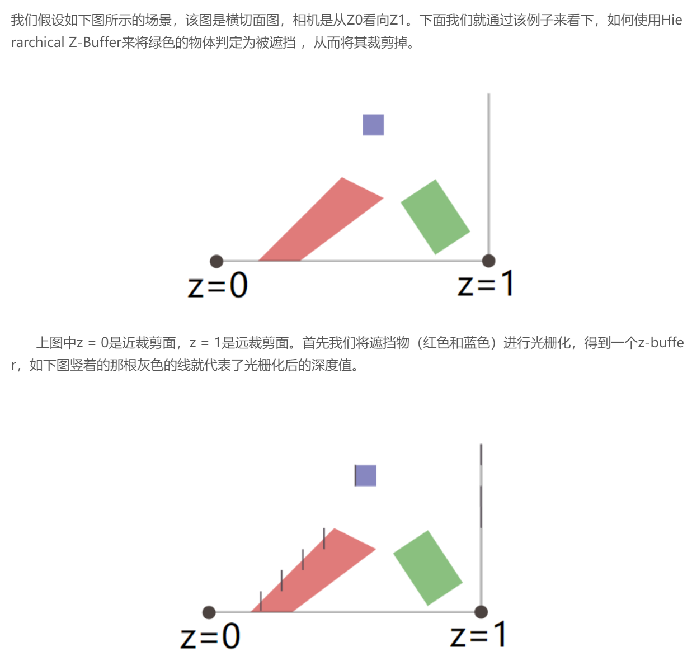
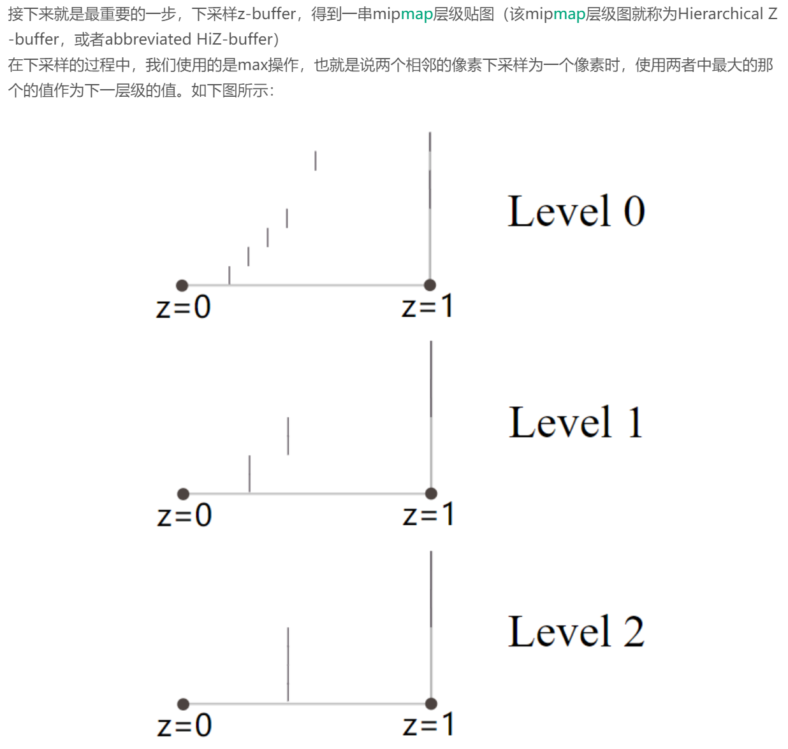
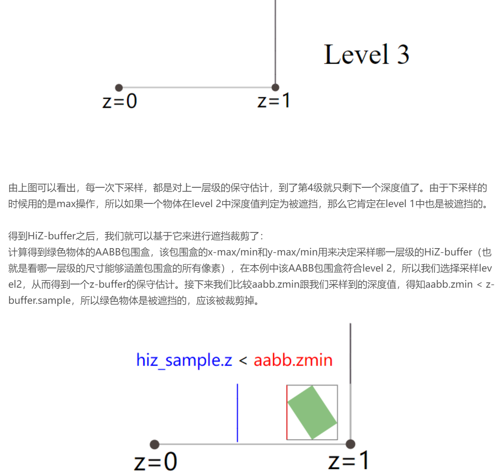

最终的HLSL

```C++
//  分布草
#pragma kernel BuildGrass
#pragma kernel HizMapInit
#pragma kernel HizMapCopy
#pragma kernel HizMapDebug

float2 _DispatchLimit;

//  xy: origin
//  zw: unit
float4 _GrassInputArgs;

//  xy: 世界比贴图大小
//  zw: 偏移距离
float4 _GrassMaskScale;

Texture2D<float4>              _GrassMaskTexture;
AppendStructuredBuffer<float4> _GrassCoordOutput;

//  Frustum
float4                         _FrustumPlanes[6];

//  HizMap
Texture2D<float4>              _HizMap;
float4x4                       _WToViewProj;
float4                         _HizMapParams;

bool IsCullByPlane(float3 coord, float width, float4 plane)
{
    return dot(coord + float3(-width, -width, -width), plane.xyz) + plane.w <= 0
        && dot(coord + float3( width, -width, -width), plane.xyz) + plane.w <= 0
        && dot(coord + float3( width,  width, -width), plane.xyz) + plane.w <= 0
        && dot(coord + float3(-width,  width, -width), plane.xyz) + plane.w <= 0

        && dot(coord + float3(-width, -width,  width), plane.xyz) + plane.w <= 0
        && dot(coord + float3( width, -width,  width), plane.xyz) + plane.w <= 0
        && dot(coord + float3( width,  width,  width), plane.xyz) + plane.w <= 0
        && dot(coord + float3(-width,  width,  width), plane.xyz) + plane.w <= 0;
}

bool IsCullByFrustum(float3 coord, float width)
{
    return IsCullByPlane(coord, width, _FrustumPlanes[0])
        || IsCullByPlane(coord, width, _FrustumPlanes[1])
        || IsCullByPlane(coord, width, _FrustumPlanes[2])
        || IsCullByPlane(coord, width, _FrustumPlanes[3])
        || IsCullByPlane(coord, width, _FrustumPlanes[4])
        || IsCullByPlane(coord, width, _FrustumPlanes[5]);
}

uint GetHizMapIndex(float2 boundsMin, float2 boundsMax)
{
    float2 uv = (boundsMax - boundsMin) * _HizMapParams.x;
    uint2 coord = ceil(log2(uv));
    uint  index = max(coord.x, coord.y);
    return min(index,_HizMapParams.y-1);
}

float3 TransformToUVD(float3 coord)
{
    float4 ndc = mul(_WToViewProj, float4(coord, 1));
    ndc.xyz /= ndc.w;
    ndc.xyz = (ndc.xyz + 1) * 0.5f;
    ndc.z   = 1.0f - ndc.z;
    return ndc.xyz;
}

//  Z: 1~0
bool IsCullByHizMap(float3 coord, float width)
{
    float3 uvd0 = TransformToUVD(coord + float3(-width, -width, -width));
    float3 uvd1 = TransformToUVD(coord + float3( width, -width, -width));
    float3 uvd2 = TransformToUVD(coord + float3( width,  width, -width));
    float3 uvd3 = TransformToUVD(coord + float3(-width,  width, -width));
    float3 uvd4 = TransformToUVD(coord + float3(-width, -width,  width));
    float3 uvd5 = TransformToUVD(coord + float3( width, -width,  width));
    float3 uvd6 = TransformToUVD(coord + float3( width,  width,  width));
    float3 uvd7 = TransformToUVD(coord + float3(-width,  width,  width));

    float3 min0 = min(min(uvd0, uvd1), min(uvd2, uvd3));
    float3 min1 = min(min(uvd4, uvd5), min(uvd6, uvd7));
    float3 boundsMin = min(min0, min1);

    float3 max0 = max(max(uvd0, uvd1), max(uvd2, uvd3));
    float3 max1 = max(max(uvd4, uvd5), max(uvd6, uvd7));
    float3 boundsMax = max(max0, max1);

    uint mip = GetHizMapIndex(boundsMin.xy, boundsMax.xy);

    float hizMapWidth = _HizMapParams.x / pow(2, mip);
    float2 uv0 = min(hizMapWidth - 1, floor(boundsMin.xy * hizMapWidth));
    float2 uv1 = min(hizMapWidth - 1, floor(boundsMax.xy * hizMapWidth));

    float d0 = _HizMap.mips[mip][uv0].r;
    float d1 = _HizMap.mips[mip][uv1].r;

    return boundsMax.z < d0 && boundsMax.z < d1;
}

[numthreads(8, 8, 1)]
void BuildGrass (uint3 id : SV_DispatchThreadID)
{
    if ((float)id.x < _DispatchLimit.x && (float)id.y < _DispatchLimit.y)
    {
        float2 worldCoord = _GrassInputArgs.xy
                          + _GrassInputArgs.zw
                          + _GrassInputArgs.zw * id.xy;

        float2 maskIndex = floor(worldCoord * _GrassMaskScale.xy);
        float4 maskValue = _GrassMaskTexture[maskIndex];
        if (maskValue.b > 0)
        {
            float2 offset = maskValue.xy * 2.0f - 1.0f;
            worldCoord.xy += _GrassMaskScale.zw*offset;
            float4 oCoord = worldCoord.xxyy * float4(1, 0, 1, 0);
            if (!IsCullByFrustum(oCoord.xyz, 0.5) &&
                !IsCullByHizMap(oCoord.xyz, 0.5))
            {
                _GrassCoordOutput.Append(oCoord);
            }
        }
    }
}

int _HizMapMip;
Texture2D<float4>   _CameraDepth;
Texture2D<float4>   _HizMapIn;
RWTexture2D<float4> _HizMapOut0;
RWTexture2D<float4> _HizMapOut1;

[numthreads(8, 8, 1)]
void HizMapInit (uint3 id : SV_DispatchThreadID)
{
    if ((float)id.x < _DispatchLimit.x && (float)id.y < _DispatchLimit.y)
    {
        float2 index = floor(id.xy / _HizMapParams.zw);
        float4 value = _CameraDepth[index];
        _HizMapOut0[id.xy] = value;
        _HizMapOut1[id.xy] = value;
    }
}

[numthreads(8, 8, 1)]
void HizMapCopy (uint3 id : SV_DispatchThreadID)
{
    if ((float)id.x < _DispatchLimit.x && (float)id.y < _DispatchLimit.y)
    {
        float2 uv = floor(id.xy * 2);
        float a = _HizMapIn[uv               ].r;
        float b = _HizMapIn[uv + float2(1, 0)].r;
        float c = _HizMapIn[uv + float2(0, 1)].r;
        float d = _HizMapIn[uv + float2(1, 1)].r;

        float v = min(min(a, b), min(c, d));
        _HizMapOut0[id.xy] = v;
        _HizMapOut1[id.xy] = v;
    }
}
```

最终效果：


从上图Game视图左上角可以看到，渲染1024 x 1024 x 1的植被，经过剔除后，每帧渲染大概1100～4000之间，比起100万，简直少了太多。因为有HizMap，减少到0也不是不可能，Demo场景只是一个平面，简单摆放了一些遮挡，在实际游戏场景中，遮挡物远比Demo中复杂，HizMap能发挥更好的效果。

**总结**

游戏里放大量植被，既是人性扭曲，也是道德沦丧，万恶之源来自人类聪明的小脑壳，我只想躺平，我不想再学习了。