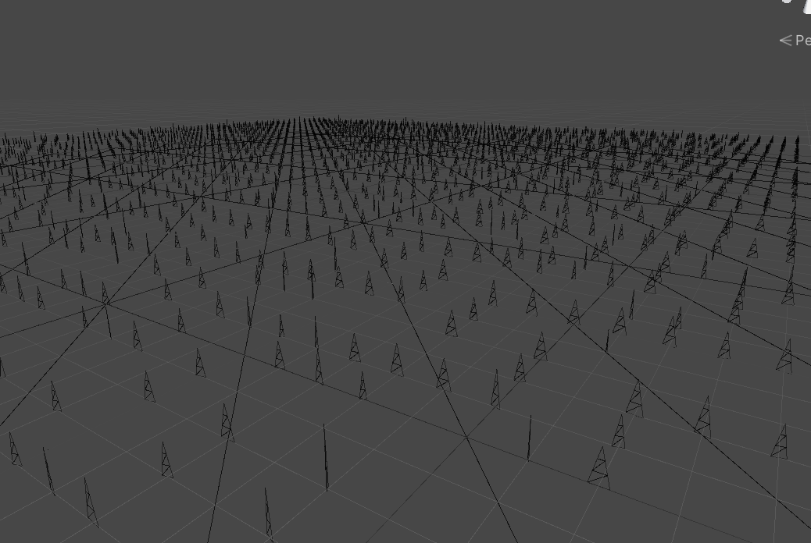

# 初次尝试GPU Driver —— 大范围植被渲染之着色

*在[《初次尝试GPU Driven —— 大范围植被渲染》
](https://www.cnblogs.com/mmc1206x/p/15542745.html)中实现了草地分布，本文实现草的着色。*

本文分四个部分：
* 生成网格
* 随机调整
* 着色
* 风场

**生成草网格**

网格形状通常有矩形和三角形，本文使用三角形的网格。


上图从左到右依次提高细节程度。

**随机调整**

用上一步生成的网格渲染，会看到这样的画面。


很显然，分布的太整齐了，草丛不是整齐排列的，所以每颗草不能都用一样的方向和大小渲染，在这一步将草随机一下。思路是通过草的世界坐标得出随机值，用该随机数去旋转&缩放顶点，因为每颗草的世界坐标是固定的，所以随机数也是固定的，又因为每颗草的坐标都不一样，所以随机数也可能会不一样（这不是病句）。

随机数的计算方法有很多，只要让其尽可能乱就行了，计算出缩放和旋转后，再加上之前算出来的世界坐标，就可以构建变换矩阵了。

```GLSL
float3 wcoord = _GrassCoords[instanceID];

...

float random(float2 pos)
{
    return frac(sin(dot(pos, float2(12.9898, 78.2330))) * 1.9);
}

...

//  平移/缩放/旋转
float  rand  = random(wcoord.xz);
//  随机缩放
float2 scale = lerp(float2(0.2, 0.5),
                    float2(0.3, 1.0), rand);
//  随机旋转
float2 rotate = float2(cos(rand * UNITY_PI * 2),
                       sin(rand * UNITY_PI * 2));

float4x4 transform = float4x4(float4(scale.x * rotate.x,       0, -rotate.y, wcoord.x),
                              float4(                 0, scale.y,         0, wcoord.y),
                              float4(         -rotate.y,       0,  rotate.x, wcoord.z),
                              float4(0, 0, 0, 1));

...

o.wcoord = mul(transform, v.vertex);
o.vertex = UnityWorldToClipPos(o.wcoord);
```



草已经被打乱了，但每颗草太直了，接下来压弯每颗草，思路是根据草的顶点Y轴朝前压弯，Y轴值越大越弯。

```GLSL
float2 forward = float2(0, 1);
float2 offset = forward * scale.y * _Bend
              * v.vertex.y * v.vertex.y;
v.vertex.xz += offset;
v.vertex.y  -= length(offset);
```


把数量翻10倍后，画面如下：


**着色**

给定两个基础颜色，分别表示草的顶部和底部色，随后用Lambert光照着色。

```GLSL
float3 worldCoord = i.wcoord;
float3 worldNormal = normalize(i.normal);
float3 lightNormal = UnityWorldSpaceLightDir(worldCoord);
float4 color = lerp(_BottomColor, _TopColor, i.vcoord.y);

fixed3 ambient = color * UNITY_LIGHTMODEL_AMBIENT.rgb;
fixed  wDotL = max(0.2, dot(worldNormal,lightNormal));
fixed3 diffuse = color * wDotL * _LightColor0.rgb;
color.rgb += ambient;
color.rgb += diffuse;
return color;
```


**风场**

这一步加入风的影响，通过风向，风速，风力三个因素定义风，随时间挪动影响范围。

本文的风区分微风和强风，微风持续影响，强风按频率影响，注意：强风需要按不太工整的频率触发影响，因为工整的频率不好看。

本文强风用下图频率：


```GLSL
//  基础风
float3 wind      = _WindDirect * _WindPower * v.vertex.y * v.vertex.y;
float  windValue = tex2Dlod(_WindMask, float4(wcoord.xz / 64, 0, 0)).r;
//  微风
wcoord.xyz += wind * sin(_Time.y * _WindSpeed + dot(wcoord, _WindDirect)) * 0.3;
//  强风
wcoord.xyz += wind * saturate(sin(_Time.y * _WindSpeed + dot(wcoord, _WindDirect)) * 2 - 1) * windValue;
wcoord.xyz += wind * saturate(sin(0.75 * _Time.y * _WindSpeed + dot(wcoord, _WindDirect)) * 2 - 1) * windValue;
wcoord.xyz += wind * saturate(sin(0.25 * _Time.y * _WindSpeed + dot(wcoord, _WindDirect)) * 2 - 1) * windValue;
```

到此，渲染部分就结束了，下面展示一段加入高度图后的最终表现：


